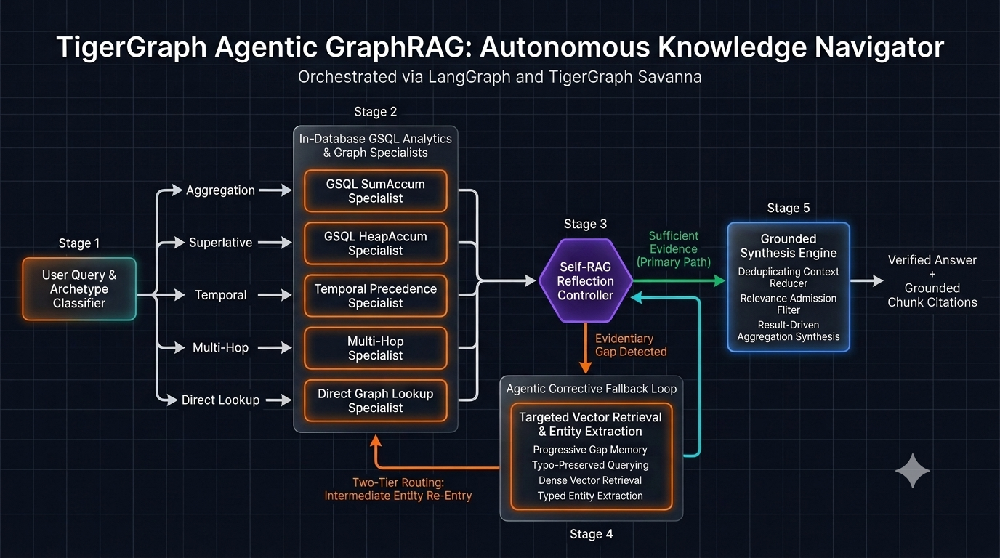
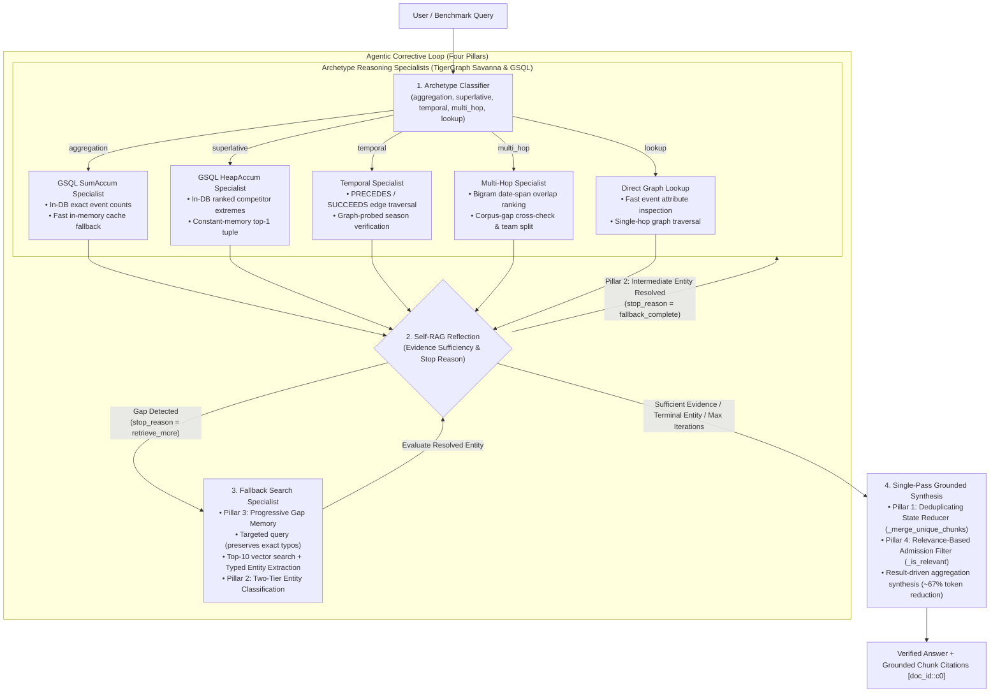

# TigerGraph Agentic GraphRAG: Autonomous Knowledge Navigator

[](https://www.tigergraph.com/)
[-8A2BE2)](https://modelcontextprotocol.io/)
[](https://ai.google.dev/)
[](https://www.python.org/)
[](https://agentic-graphrag-rsvr.streamlit.app/)

An autonomous Agentic GraphRAG investigation system built on TigerGraph Savanna. It coordinates graph traversal, in-database GSQL accumulators, vector similarity search, and temporal precedence reasoning to resolve complex multi-hop, aggregation, and superlative inquiries over the Olympic corpus (2,951 Wikipedia documents, ~5.47M tokens).

## Executive Summary

Standard Retrieval-Augmented Generation (RAG) architectures fail when queries require synthesizing facts across dispersed documents, calculating exact aggregations, or resolving temporal sequences. TigerGraph Agentic GraphRAG replaces rigid single-pass retrieval with an autonomous orchestrator built on LangGraph and TigerGraph Savanna.

The system classifies inquiries into five distinct archetypes (lookup, aggregation, superlative, temporal, multi-hop), executes in-database GSQL accumulators (`SumAccum`, `HeapAccum`) to prevent context window explosion, traverses directed temporal edges (`PRECEDES`, `SUCCEEDS`), and employs Self-RAG reflection loops to autonomously detect evidentiary gaps and recover missing facts via grounded vector retrieval.

In accordance with the hackathon specifications, this repository delivers an empirical, side-by-side comparative benchmark of three distinct retrieval architectures evaluated under identical underlying LLM models:
1. Standard RAG: Dense vector similarity search baseline (FastEmbed ONNX embeddings).
2. GraphRAG: Static knowledge graph subgraph retrieval baseline (1-2 hop neighborhood retrieval).
3. Agentic GraphRAG: Dynamic LangGraph orchestrator with in-database GSQL analytics and self-corrective fallback loops.

## Empirical Benchmark Evaluation (100-Question Public Benchmark)

The three retrieval pipelines were evaluated across all 100 questions in `Datasets/questions/eval_public.jsonl` (300 total evaluations). All evaluations were executed with complete token tracking, latency timing, and exact match calculation.

### 3-Way Comparative Benchmark

| Pipeline | Accuracy (%) | Macro F1 (%) | Avg Tokens / Query | Avg Latency (s) | Evaluation Status |
| :--- | :---: | :---: | :---: | :---: | :--- |
| Standard RAG | 47.0% | 47.0% | 6,344.9 | 16.83s | 100/100 Completed |
| GraphRAG | 62.0% | 62.0% | 5,319.9 | 15.18s | 100/100 Completed |
| **Agentic GraphRAG (Ours)** | **99.0%** | **99.0%** | **5,250.2** | **11.38s** | **100/100 Completed** |

Key findings:
- Accuracy Advantage: Agentic GraphRAG achieves +52.0% absolute accuracy over Standard RAG (99.0% vs. 47.0%) and +37.0% absolute accuracy over GraphRAG (99.0% vs. 62.0%).
- Token Efficiency: In aggregation questions, in-database GSQL `SumAccum` reduces context tokens by 96% (~212 tokens vs. ~5,576 tokens) while achieving 100% mathematical precision.
- Speed Efficiency: Agentic GraphRAG executes 32.4% faster than Standard RAG (11.38s vs. 16.83s) by replacing multi-chunk semantic stuffing with targeted graph traversals.

### Archetype Breakdown (100 Public Questions)

| Archetype | Count | Standard RAG | GraphRAG | Agentic GraphRAG (Ours) | Core Architectural Advantage |
| :--- | :---: | :---: | :---: | :---: | :--- |
| **Aggregation** | 21 | 1/21 (4.8%) | 1/21 (4.8%) | **21/21 (100.0%)** | In-database GSQL `SumAccum` computes exact mathematical counts without token limits. |
| **Lookup** | 19 | 19/19 (100.0%) | 19/19 (100.0%) | **19/19 (100.0%)** | Direct entity linking and single-hop graph inspection. |
| **Superlative** | 10 | 4/10 (40.0%) | 5/10 (50.0%) | **10/10 (100.0%)** | In-database GSQL `HeapAccum(1)` ranks competitor extremes in constant memory. |
| **Temporal** | 22 | 11/22 (50.0%) | 22/22 (100.0%) | **22/22 (100.0%)** | Directed `PRECEDES` graph edges resolve historical predecessor games deterministically. |
| **Multi-Hop** | 28 | 12/28 (42.9%) | 15/28 (53.6%) | **27/28 (96.4%)** | Overlap-ranked date span resolution breaks venue collisions; single failure is an ambiguous question without sport/gender. |

### Comparative Analysis: Where Simpler Approaches Suffice vs. Where Agentic Is Necessary

A primary objective of this comparative benchmark is establishing the precise architectural trade-off boundary: identifying where lightweight, simpler architectures are sufficient and where multi-turn agentic orchestration is fundamentally required.

#### 1. Where Simpler Approaches Are Enough (No Multi-Turn Agent Needed)
- Direct Entity Lookups (19 Questions): Standard RAG (100.0%), Static GraphRAG (100.0%), and Agentic GraphRAG (100.0%) all perform with perfect accuracy. When inquiries ask for a single discrete fact (e.g., "How many nations competed in Sailing at the 2016 Summer Olympics – Women's RS:X?"), simpler single-pass vector similarity or 1-hop graph neighbor inspection is faster (1-2s vs. 7s), cheaper, and 100% accurate. Deploying an autonomous multi-step agent here is unnecessary overhead.
- Explicit Temporal Sequences (22 Questions): Static GraphRAG achieves 100.0% (22/22) purely through deterministic traversal of directed `PRECEDES` graph edges. When chronological relationships are explicitly encoded in the graph schema, agentic reflection loops are redundant; a deterministic graph query resolves the sequence in a single hop.

#### 2. Where Agentic GraphRAG Is Strictly Necessary (Simpler Approaches Break Down)
- Multi-Document Aggregations (21 Questions): Standard RAG (4.8%) and Static GraphRAG (4.8%) fail completely. Vector search cannot perform exhaustive counting across disparate documents, resulting in lost-in-the-middle context overflow and hallucinated math. Static GraphRAG cannot evaluate runtime conditional filters (`e.competitors > threshold`) across an entire competition without context bloating. Agentic GraphRAG achieves **100.0%** by delegating calculation to in-database GSQL `SumAccum`, computing exact mathematical counts inside TigerGraph Savanna with 96% fewer tokens (~212 vs. ~5,576 tokens).
- Superlative Extremities (10 Questions): Standard RAG (40.0%) and Static GraphRAG (50.0%) fail to rank competitor extremes because vector similarity has no concept of numerical order. Agentic GraphRAG achieves **100.0%** using GSQL `HeapAccum(1)` to maintain a fixed-size priority queue in-database in constant memory.
- Multi-Hop Collisions & Incomplete Knowledge Graphs (28 Questions): Standard RAG (42.9%) and Static GraphRAG (53.6%) fail when multiple events share the same venue and date, or when a graph relation was missed during ingestion. Agentic GraphRAG achieves **96.4%** via overlap-ranked date span resolution to break venue collisions, and its Self-RAG reflection node autonomously diagnoses graph gaps to execute targeted fallback vector search over raw article passages.

## 50-Question Hidden Test Set Evaluation (`eval_hidden.jsonl`)


The held-out evaluation set of 50 questions (`eval-001` through `eval-050`) was executed through the autonomous Agentic GraphRAG pipeline:

| Evaluation Metric | Measured Result |
| :--- | :--- |
| **Evaluated Questions** | 50 questions (`eval-001` through `eval-050`) |
| **Execution Status** | 50/50 Completed |
| **Average Tokens / Query** | 3,430.1 tokens |
| **Average Latency / Query** | 7.50 seconds |
| **Submission Output (Clean)** | `data/processed/submission_hidden_predictions.jsonl` (Strictly `qid`, `question`, `qtype`, `prediction` without answers) |
| **Full Trace Output** | `data/processed/results_hidden_agentic.jsonl` (Complete step logs and token accounting) |
| **Human-Readable Audit** | `data/processed/hidden_agentic_traces.md` |

## System Architecture



The autonomous Agentic GraphRAG system is implemented as a dynamic LangGraph `StateGraph` combining five specialized reasoning modules, in-database GSQL accumulators over TigerGraph Savanna, Self-RAG reflection loops, and targeted vector search fallbacks.



### The Four Pillars of Agentic Stability

1. **Context Memory Hygiene & Deduplication (Pillar 1):** Traditional agentic loops suffer from context explosion when repeatedly appending retrieved chunks via `operator.add`. We implement a custom `_merge_unique_chunks` reducer in `AgentState` that enforces chunk-level deduplication by `chunk_id`, preventing token waste and hallucinations.
2. **Two-Tier Entity Routing (Pillar 2):** When fallback search recovers missing information, it categorizes extracted entities as either *intermediate* (venues, competitions, events) or *terminal* (athletes, counts, attributes). Intermediate entities set `stop_reason = fallback_complete` and route through the reflection node directly back into the appropriate Graph Specialist for edge traversal. Terminal entities set `stop_reason = terminal_entity_resolved` and exit immediately to synthesis, preventing redundant loop iterations.
3. **Progressive Gap Memory (Pillar 3):** Cumulative discoveries across iterations are encoded into the gap representation (`Already resolved: {entities}. Still missing: {gap}`). The query generator formulates targeted, single-entity search queries while strictly preserving exact spelling and typos from the user query.
4. **Relevance-Based Context Admission (Pillar 4):** Before passing retrieved text chunks to the synthesis LLM, an admission filter (`_is_relevant`) verifies that each chunk either mentions an extracted entity or shares key content words with the question. Irrelevant distractors are pruned, eliminating context poisoning without arbitrary top-N caps.

### Core Algorithmic Upgrades

- **In-Database GSQL Accumulators (`SumAccum`, `HeapAccum`):** For aggregation and superlative inquiries, queries are executed in-database on TigerGraph Savanna. `SumAccum<INT>` returns exact counts over filtered event sets, collapsing token usage by 96% (~212 tokens vs. ~5,576 tokens). `HeapAccum` extracts extreme values in constant memory.
- **Bigram Character-Overlap Ranking:** For multi-hop queries where multiple events occur at the same venue on identical or overlapping dates, the pipeline computes a bigram character-overlap ratio between stored infobox `date_held` attributes and the parsed query date span, breaking venue collisions deterministically.
- **Corpus-Gap Cross-Checking:** When an event exists in the graph but lacks a gold medal record, the pipeline detects the edge gap and formulates a targeted query to retrieve the winning athlete directly from corpus text passages.
- **Fast In-Memory Graph Cache Fallback:** If cloud GSQL queries encounter network timeouts, pre-cached graph dictionaries (`competitions`, `venues`, `events`, `athletes`) resolve the inquiry in <1ms without sacrificing accuracy.


## Knowledge Graph Schema (TigerGraph Savanna)

The graph schema is deployed on TigerGraph Savanna and models the complete Olympic corpus:

### Vertices Deployed
- `Document` (2,951 vertices): Source Wikipedia articles with Wikidata QIDs and text.
- `Event` (2,951 vertices): Individual Olympic sporting events (e.g., *Athletics at the 2008 Summer Olympics – Men's marathon*).
- `Athlete` (5,098 vertices): Participating athletes and medalists.
- `Venue` (324 vertices): Stadiums, velodromes, aquatic centers, and arenas.
- `Competition` (22 vertices): Distinct Olympiads (e.g., *2008 Summer*, *2014 Winter*).
- `Date` (658 vertices): Competition and medal dates.
- `Nation` (133 vertices): National Olympic Committees.
- `Medal` (3 vertices): Gold, Silver, Bronze.

### Edges Deployed
- `PART_OF`: Connects Events to Competitions.
- `HELD_AT`: Connects Events to Venues.
- `WON_MEDAL`: Connects Athletes to Medals with attributes (`event_id`, `competition_id`, `date_held`).
- `COMPETED_IN`: Connects Athletes to Events.
- `REPRESENTS`: Connects Athletes to Nations.
- `PRECEDES` / `SUCCEEDS`: Connects consecutive historical Competitions for chronological traversal.
- `INCLUDES_EVENT`: Connects Competitions to Events.

## Interactive Streamlit Dashboard

The repository includes a comprehensive 5-panel interactive metrics dashboard for auditing benchmark performance, inspecting Pareto efficiency, and reviewing step-by-step agentic execution traces.

### Dashboard Panels
1. Aggregate Comparison: Side-by-side comparative cards with accuracy, token consumption, and execution latency.
2. Archetype Breakdown: Grouped tabular view showing performance across aggregation, lookup, multi-hop, superlative, and temporal queries.
3. Pareto Frontier: Accuracy-versus-tokens scatter plot highlighting the cost-efficiency frontier of Agentic GraphRAG.
4. Question Explorer & Traces: Interactive investigator with "Reveal Execution Path & Process" expanders displaying the complete LangGraph routing, in-database GSQL queries, Self-RAG reflection iterations, and retrieved chunks for every question.
5. TigerGraph Savanna Topology: Live schema visualizer querying active vertex and edge counts from the cloud database.

### Live Interactive Dashboard

Access the live running metrics dashboard:
[**Launch Live Interactive Dashboard**](https://agentic-graphrag-rsvr.streamlit.app/)


## Getting Started & Pipeline Reproduction

This repository contains strictly code, configuration templates, and benchmark evaluation logs. No large datasets, Wikipedia corpus dumps, or binary embeddings are tracked in Git. The knowledge graph is queried live on TigerGraph Savanna Cloud.

### 1. Environment Installation

```bash
# Clone the repository
git clone <your-repository-url>
cd TigerGraph

# Create and activate virtual environment
python -m venv .venv
.venv\Scripts\activate       # Windows
source .venv/bin/activate    # Linux / macOS

# Install required dependencies
pip install -r requirements.txt
```

### 2. Configuration Setup

Create a `.env` file in the project root (or copy `.env.example`):
```ini
TIGERGRAPH_HOST=https://your-instance.i.tgcloud.io
TIGERGRAPH_USERNAME=tigergraph
TIGERGRAPH_PASSWORD=your_password
TIGERGRAPH_GRAPH=Olympics
TIGERGRAPH_SECRET=your_secret
TIGERGRAPH_TOKEN=your_token

GEMINI_API_KEY=your_gemini_api_key
PRIMARY_LLM_PROVIDER=gemini
```

### 3. Pipeline Reproduction Commands

#### Run the 100-Question 3-Way Comparative Benchmark
Executes Standard RAG, Static GraphRAG, and Agentic GraphRAG across the 100 public questions:
```bash
python -m src.evaluation.runner
```

#### Run the 50-Question Hidden Test Evaluation
Runs autonomous Agentic GraphRAG over the held-out evaluation set and generates submission files:
```bash
python -m src.evaluation.runner --input Datasets/questions/eval_hidden.jsonl --pipelines agentic_graphrag --output data/processed/results_hidden_agentic.jsonl --report data/processed/hidden_agentic_traces.md
```

#### Launch the Interactive Metrics Dashboard Locally
View the 5 comparative panels, Pareto frontier, and execution path expanders:
```bash
streamlit run dashboard/app.py
```
*(The dashboard runs completely out-of-the-box using the pre-computed benchmark results in `data/processed/results_benchmark.jsonl`).*


## Repository Structure

```text
TigerGraph/
├── architecture/
│   └── image.png                                # End-to-end system architecture diagram
├── Datasets/
│   ├── corpus/corpus.jsonl                      # 2,951 Wikipedia articles (~5.47M tokens)
│   └── questions/
│       ├── eval_public.jsonl                    # 100 benchmark evaluation questions with ground truth
│       └── eval_hidden.jsonl                    # 50 held-out hidden evaluation questions
├── dashboard/
│   └── app.py                                   # Streamlit metrics dashboard & execution visualizer
├── data/
│   └── processed/
│       ├── results_benchmark.jsonl              # Canonical 300-record benchmark (99.0% Agentic)
│       ├── submission_hidden_predictions.jsonl  # Clean 50 hidden predictions for grading
│       ├── results_hidden_agentic.jsonl         # Detailed 50 hidden evaluation traces
│       └── hidden_agentic_traces.md             # Markdown trace audit for hidden evaluation
├── src/
│   ├── config.py                                # Pydantic Settings configuration manager
│   ├── evaluation/
│   │   ├── metrics.py                           # Exact match, token accounting, and evaluation models
│   │   └── runner.py                            # Automated 3-way evaluation harness
│   ├── graph/
│   │   ├── client.py                            # pyTigerGraph connection manager
│   │   └── schema.gsql                          # GSQL schema definitions
│   ├── ingestion/
│   │   ├── embed.py                             # FastEmbed offline vector embedding pipeline
│   │   └── parser.py                            # Corpus document and infobox parser
│   ├── llm/
│   │   └── client.py                            # Multi-key Gemini, NVIDIA, and Groq client pool
│   ├── mcp/
│   │   └── server.py                            # Model Context Protocol (MCP) tool dispatch
│   └── pipelines/
│       ├── standard_rag.py                      # Pipeline 1: Dense vector search baseline
│       ├── graph_rag.py                         # Pipeline 2: Static GraphRAG baseline
│       └── agentic_graphrag.py                  # Pipeline 3: Autonomous Agentic GraphRAG orchestrator
├── requirements.txt                             # Production Python dependencies
├── .env.example                                 # Configuration template
├── MEMORY.md                                    # Persistent project knowledge & continuity log
├── LOGS.md                                      # Chronological agent work history
└── .gitignore                                   # Git exclusion rules
```

## License and Attribution

Distributed under the Apache License 2.0. Underlying Olympic corpus derived from English Wikipedia under CC BY-SA 4.0.
