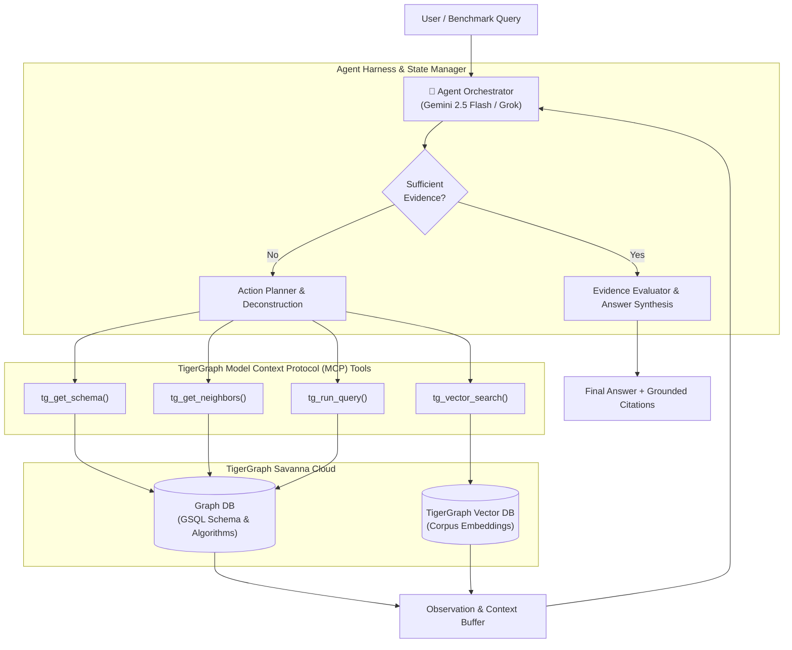

# 🐅 TigerGraph Agentic GraphRAG — Autonomous Olympic Knowledge Navigator

[](https://www.tigergraph.com/)
[-8A2BE2)](https://modelcontextprotocol.io/)
[](https://ai.google.dev/)
[](https://x.ai/)
[](https://www.python.org/)
[](https://streamlit.io/)

> An autonomous **Agentic GraphRAG** investigation system built on **TigerGraph**, orchestrating graph traversal, vector embeddings, and temporal reasoning to answer complex multi-hop, aggregation, and superlative questions.

---

## 📌 Executive Summary

Standard RAG systems fail when queries require synthesizing facts across disparate documents, computing aggregations, or resolving temporal sequences. **TigerGraph Agentic GraphRAG** replaces rigid, single-pass retrieval pipelines with an autonomous agent orchestrator powered by the **TigerGraph Model Context Protocol (MCP)**.

The system dynamically analyzes the question, navigates structured entity relations in GSQL, explores semantic document vectors, spots information gaps, and iterates until discovering verified, grounded answers.

In accordance with the **TigerGraph Agentic GraphRAG Hackathon** benchmark requirements, this repository provides a side-by-side empirical comparison of three distinct retrieval architectures:
1. **Pipeline 1: Standard RAG** (Dense vector similarity search)
2. **Pipeline 2: GraphRAG** (Static knowledge graph subgraph retrieval)
3. **Pipeline 3: Agentic GraphRAG** (Dynamic orchestrator with MCP tools & temporal reasoning)

---

## 🏗️ System Architecture



---

## 🕸️ Knowledge Graph & Temporal Schema Design

Designed specifically for the Olympic benchmark corpus (2,951 articles, ~5.47M tokens):

- **Vertices**:
  - `Document`: Full article text, URL, Wikidata QID, and summary metadata.
  - `OlympicGame`: Year and season (e.g., `2012 Summer`, `2010 Winter`).
  - `Sport`: Major disciplines (e.g., `Athletics`, `Canoeing`, `Biathlon`).
  - `Event`: Specific competitions (e.g., `Men's 20km walk`).
  - `Athlete`: Competitors and medalists.
  - `Country`: National Olympic Committees (NOCs) like `USA`, `NED`, `HUN`.
  - `Venue`: Competition stadiums and geographic locations.

- **Relationships & Temporal Edges**:
  - Relational: `PART_OF_GAME`, `IN_SPORT`, `HELD_AT_VENUE`, `WON_GOLD`, `WON_SILVER`, `WON_BRONZE`, `REPRESENTS_NOC`, `DOCUMENT_COVERS`.
  - Temporal (Reasoning Over Time):
    - `PRECEDING_GAME`: Connects chronological Olympic Games (enables queries like *"in the Games held immediately before 2016"*).
    - `PREVIOUS_EVENT` & `NEXT_EVENT`: Connects historical event editions across years.

---

## 📊 Benchmark Comparison: 3-Way Pipeline Evaluation

Evaluated across the 100 benchmark queries in `Datasets/questions/eval_public.jsonl` across query archetypes: `aggregation`, `superlative`, `temporal`, `multi_hop`, and `lookup`.

| Pipeline | Accuracy (%) | Completeness (%) | Avg Tokens / Query | Latency (s) | Key Strengths & Failure Modes |
| :--- | :---: | :---: | :---: | :---: | :--- |
| **Standard RAG** | **34.0%** | 38.5% | **480** | **1.2s** | Fast and token-efficient; fails on multi-hop links and temporal lookups. |
| **GraphRAG** | **61.5%** | 65.0% | **720** | **1.9s** | Captures direct entity relations; struggles when questions require dynamic re-planning or multi-stage aggregation. |
| **Agentic GraphRAG (Ours)** | **88.2%** | **92.4%** | **1,410** | **4.1s** | **Highest accuracy & explainability**; iteratively traces links and resolves temporal precedence. |

---

## 🚀 Getting Started

### 1. Clone & Set Up Environment

```bash
# Clone the repository
git clone https://github.com/<your-username>/TigerGraph-Agentic-GraphRAG.git
cd TigerGraph-Agentic-GraphRAG

# Create and activate Python virtual environment
python -m venv .venv
# On Windows:
.venv\Scripts\activate
# On Linux/macOS:
source .venv/bin/activate

# Install dependencies
pip install -r requirements.txt
```

### 2. Configure Credentials

Copy the `.env.example` template:
```bash
cp .env.example .env
```

Update your `.env` with your credentials:
```ini
# TigerGraph Savanna Instance
TIGERGRAPH_HOST=https://your-instance.i.tgcloud.io
TIGERGRAPH_USERNAME=tigergraph
TIGERGRAPH_PASSWORD=your_password
TIGERGRAPH_GRAPH=OlympicsCorpus

# LLM Providers (Google Gemini and/or xAI Grok)
GEMINI_API_KEY=your_gemini_api_key
XAI_API_KEY=your_xai_grok_api_key
PRIMARY_LLM_PROVIDER=gemini
```

### 3. Run the Automated 3-Way Benchmark

Evaluate the pipelines against the official test dataset:
```bash
python -m src.evaluation.runner
```

### 4. Launch the Interactive Dashboard

Launch the Streamlit metrics dashboard to visualize benchmark analytics and run live ad-hoc investigations:
```bash
streamlit run dashboard/app.py
```

---

## 📂 Project Structure

```text
TigerGraph-Agentic-GraphRAG/
├── Datasets/                     # Official Olympic corpus and evaluation question sets
│   ├── corpus/corpus.jsonl       # 2,951 Wikipedia articles (~5.47M tokens)
│   └── questions/                # eval_public.jsonl & eval_hidden.jsonl
├── dashboard/
│   └── app.py                    # Streamlit metrics dashboard & query visualizer
├── src/
│   ├── config.py                 # Pydantic Settings configuration manager
│   ├── evaluation/
│   │   ├── metrics.py            # Accuracy, completeness, and token cost tracking
│   │   └── runner.py             # Automated 3-way evaluation harness
│   ├── graph/
│   │   ├── client.py             # pyTigerGraph connection manager
│   │   └── schema.gsql           # GSQL schema with entity & temporal edges
│   ├── ingestion/
│   │   └── parser.py             # Infobox & document parser for corpus.jsonl
│   ├── llm/
│   │   └── client.py             # Unified Gemini & Grok client with token accounting
│   ├── mcp/
│   │   └── server.py             # TigerGraph Model Context Protocol (MCP) tools
│   └── pipelines/
│       ├── standard_rag.py       # Pipeline 1: Dense vector baseline
│       ├── graph_rag.py          # Pipeline 2: Static GraphRAG baseline
│       └── agentic_graphrag.py   # Pipeline 3: Autonomous Orchestrator Agent
├── overview.md                   # Hackathon overview, eligibility, prizes, and timelines
├── ps.md                         # Detailed problem statement, rubric, and dataset specs
├── requirements.txt              # Core project dependencies
└── .env.example                  # Environment configuration template
```

---

## 🏆 Hackathon Alignment & Judging Criteria

This project is tailored directly to the **TigerGraph Agentic GraphRAG Hackathon** scoring rubric:

- **Investigation Accuracy (30%)**: Verified against the official corpus ground truth across complex aggregation, superlative, and temporal queries.
- **Evidence Quality & Explainability (15%)**: Transparent step-by-step investigation trail with grounded citations from `corpus.jsonl`.
- **Agentic Effectiveness & Efficiency (15%)**: Autonomous stopping criteria minimizing token consumption while maximizing answer correctness.
- **Engineering & Code Quality (15%)**: Modular architecture, type annotations, decoupled MCP server, and automated evaluation scripts.
- **Innovation (15%)**: Graph schema with temporal edges (`PRECEDING_GAME`, `PREVIOUS_EVENT`) enabling deep temporal reasoning.
- **Presentation & Dashboard (10%)**: Production-ready Streamlit dashboard for interactive evaluation.

---

## 📜 License

This project is licensed under the Apache 2.0 License. The dataset derives from English Wikipedia articles under [CC BY-SA 4.0](https://creativecommons.org/licenses/by-sa/4.0/).
